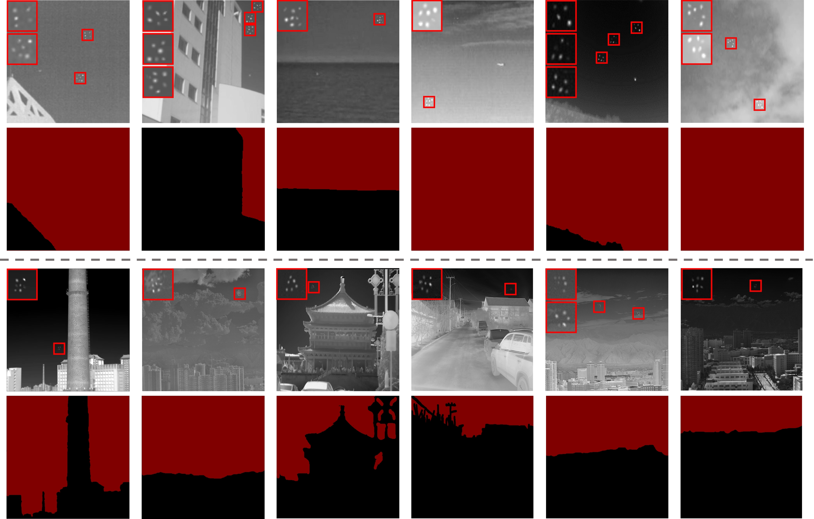
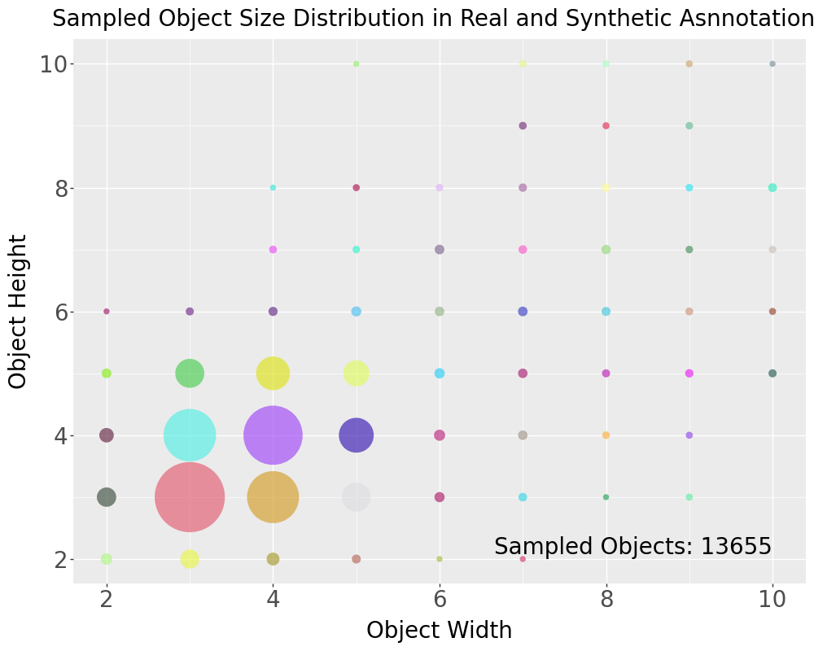
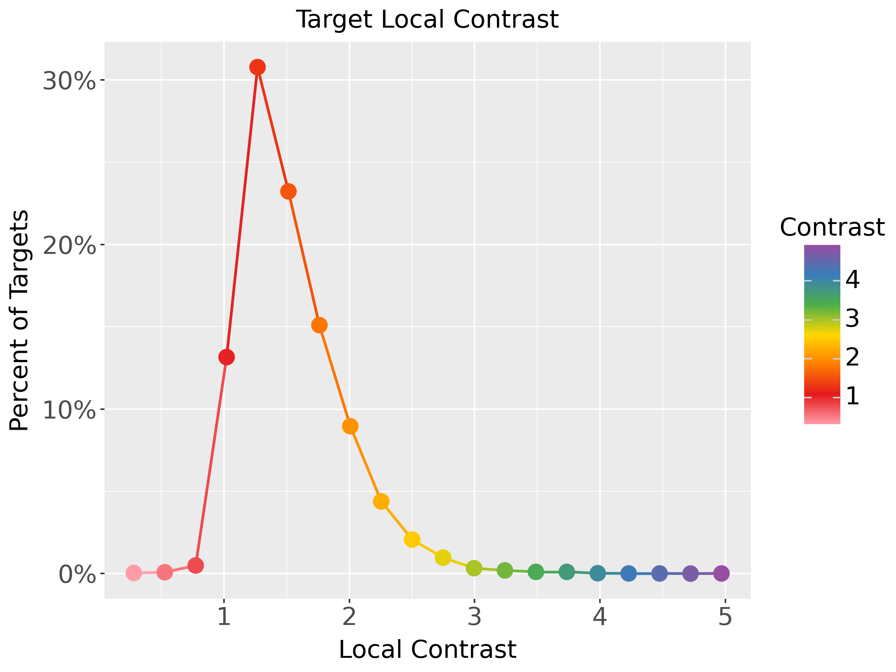
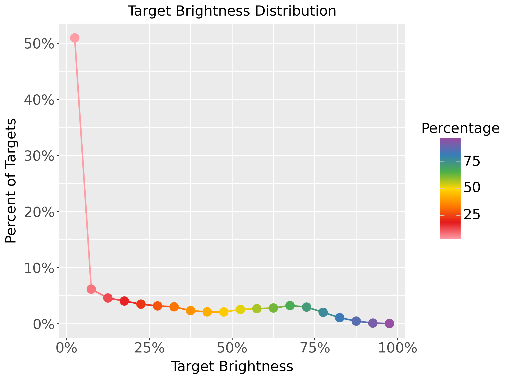

# Background Semantics Matter: Cross-Task Feature Exchange Network for Clustered Infrared Small Target Detection With Sky-Annotated Dataset

- [Introduction](#introduction)
    - [Dataset Composition](#dataset-composition)
    - [Annotations and Labels](#lnnotations-and-labels)
    - [Statistical Characteristics](#statistical-characteristics)
- [Dataset Structure](#dataset-structure)

### Paper link: [Background Semantics Matter: Cross-Task Feature Exchange Network for Clustered Infrared Small Target Detection With Sky-Annotated Dataset](https://arxiv.org/abs/2407.20078)

### The repository of BAFE-Net: https://github.com/GrokCV/BAFE-Net


## Introduction

You can **download** our DenseSIRST dataset from [**Google Drive**](https://drive.google.com/uc?export=download&id=1PY0d1WuCjf_3wAIjDSNhYxREVK27OLzl).<br>

Detecting small, low-contrast objects against complex backgrounds in infrared images is a major challenge. Existing datasets mainly feature sparsely distributed objects and lack pixel-wise background annotations. This is in stark contrast to the dense, tiny objects often encountered in the real world.
To bridge this gap, we propose DenseSIRST: a carefully annotated infrared image dataset filled with densely clustered small objects, a more realistic and challenging benchmark for algorithm training and evaluation.We shows a set of images from the DenseSIRST dataset, demonstrating the dense distribution of small objects and the corresponding sky segmentation annotations. These annotations provide valuable background information for developing and evaluating detection algorithms.

| Datasets | Image Type | Annotation Type | Image Number | Target Number | Average Target Area | Sparse or Clustered | Background Semantic Annotation |
| - | - | - | - | - | - | - | - |
| SIRST V1 | Real | Pixel | 427 | 533 | 23 | Sparse | × |
| SIRST V2 | Real | Pixel + BBox + Point | 1024 | 648 | 24 | Sparse | × |
| IRSTD1K | Real | Pixel | 1001 | 1495 | 38 | Sparse | × |
| SIRSTAUG | Synthetic | Pixel | 8525 | 9278 | 88 | Sparse | × |
| **DenseSIRST (Ours)** | Real + Synthetic | Pixel + BBox + Point | 1024 | **13655** | **6** | **Cluster** | **√** |




### Dataset Composition

- The DenseSIRST dataset comprises 1,024 infrared images.
- It contains a total of 13,655 densely clustered small targets.
- The dataset covers a variety of realistic scenarios, including:
    - Urban areas
    - Mountainous regions
    - Maritime environments
    - Cloudy scenes

### Annotations and Labels

- Each image is annotated with three types of labels:
    - Pixel-level masks: Provide precise segmentation of each target for fine-grained evaluation.
    - Bounding boxes: Encapsulate each target, allowing for assessment of detection performance using metrics such as precision, recall, and F1 score.
    - Point annotations: Mark the center of each target for evaluating localization accuracy.
### Statistical Characteristics

- Most targets are extremely small, predominantly below 5 × 5 pixels. The most frequent target size is 3 × 3 pixels, reflecting small target detection in infrared imagery.
- 90% of targets have local contrast below 2, indicating difficulty in detecting targets against cluttered backgrounds. Nearby targets within dense clusters can be included in background calculations, leading to underestimation of local contrast, complicating detection.
- Only a minority of targets are the brightest points in their images, highlighting the inadequacy of brightness as a distinguishing feature for target detection.

<div align="center">
  
</div>
<p float="left">
  
  
</p>


## Dataset Structure

For both training and inference, the following dataset structure is required:

```angular2html
|- data
    |- SIRSTdevkit
        |-PNGImages
            |-Misc_1.png
            ......
        |-SIRST
            |-BBox
                |-Misc_1.xml
                ......
            |-BinaryMask
                |-Misc_1_pixels0.png
                |-Misc_1.xml
                ......
            |-PaletteMask
                |-Misc_1.png
                ......
            |-Point_label
                |-Misc_1_pixels0.txt
                ......
        |-SkySeg
            |-BinaryMask
                |-Misc_1_pixels0.png
                |-Misc_1.xml
                ......
            |-PaletteMask
                |-Misc_1.png
                ......
        |-Splits
            |-train_v2.txt
            |-test_v2.txt
            ......
```

- PNGImages is the folder for storing all images.
- SIRST and SkySeg are folders for storing annotation files.
    - SIRST corresponds to infrared small targets.
    - SkySeg corresponds to sky segmentation.

Please make sure that the path of your data set is consistent with the `data_root` in `configs/detection/_base_/datasets/sirst_det_seg_voc_skycp.py`

## Citation

If you use our dataset or code in your research, please cite this project.

```bibtex
@article{xiao2024bafenet,
	title={Background Semantics Matter: Cross-Task Feature Exchange Network for Clustered Infrared Small Target Detection With Sky-Annotated Dataset}, 
	author={Mengxuan Xiao and Qun Dai and Yiming Zhu and Kehua Guo and Huan Wang and Xiangbo Shu and Jian Yang and Yimian Dai},
	year={2024},
	journal={arXiv preprint arXiv:2407.20078},
}

@article{dai2023one,
  title={One-stage cascade refinement networks for infrared small target detection},
  author={Dai, Yimian and Li, Xiang and Zhou, Fei and Qian, Yulei and Chen, Yaohong and Yang, Jian},
  journal={IEEE Transactions on Geoscience and Remote Sensing},
  volume={61},
  pages={1--17},
  year={2023},
}
```
